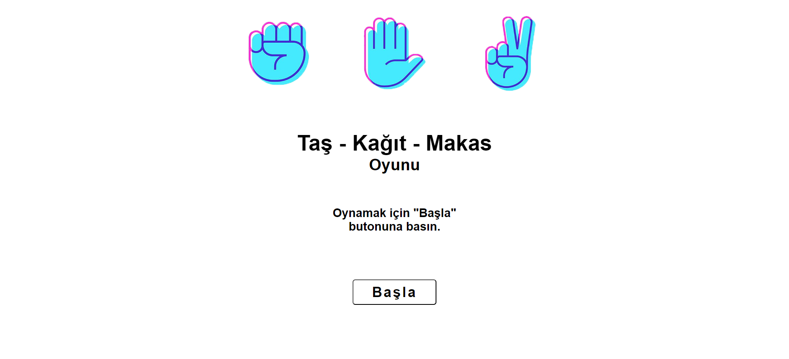
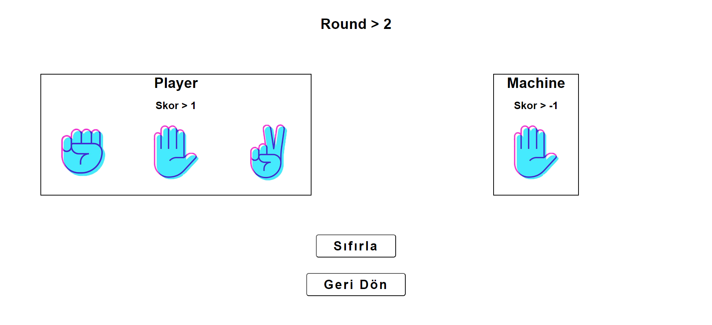

<h1 align="center">✊✋✌️ Rock-Paper-Scissors Game</h1>

"My first interactive game built with JavaScript"

---

## 🎯 Proje Hakkında

Bu proje, temel JavaScript bilgilerimi pekiştirmek amacıyla geliştirdiğim basit bir **Taş-Kağıt-Makas** oyunudur.  
Kullanıcı bir hamle yapar, bilgisayar rastgele karşılık verir. Kazanan belirlenir ve puanlar tutulur. Oyun sıfırlanabilir ve round sayısı takip edilir.

---

## 🎮 Oyun Özellikleri

- Kullanıcı - Bilgisayar karşılaşması  
- Rastgele makine hamlesi  
- Kazanan belirleme & puanlama  
- Round takibi  
- Oyun sıfırlama

---

## 🖼️ Arayüz Görselleri

### 🔸 Ana Sayfa  

### 🔸 Oyun Sayfası  

---

## 🛠️ Kullanılan Teknolojiler

- HTML5  
- CSS3  
- JavaScript (Vanilla)

---

## 📎 Not

Bu proje, JavaScript'e giriş seviyesinde yazılmıştır ve temel etkileşimli oyun mantığını öğretmek amacıyla hazırlanmıştır.

---

## 📫 İletişim

E-posta: **ahmetcnaltintas@gmail.com**  
Web sitesi: [ahmetcanaltintas.com](https://ahmetcanaltintas.com)  
LinkedIn: [linkedin.com/in/ahmetcnaltintas](https://linkedin.com/in/ahmetcnaltintas)
